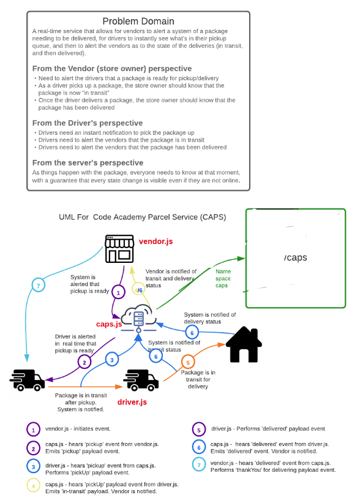

# Lab 12:CAPS-Socket.io (caps.js)
## Authors: Taylor Thornton & Clement Buchanan

This element of our socket.io API acts as the "hub".  In this file a generic socket server is started, one namespace is declared (/caps) of off the socket server.  `socket.broadcast.emit` is used within the namespace connection so that our clients (vendor.js and driver.js) have access to events and payload.

## Setup
- npm init
- Install dependencies: faker.js, socket.io@2, socket.io-client@2, dotenv
- in your local environment, create a .env to declare PORT and STORE_NAME

## Returns Object (Sample)
- logs server connection 
- logs name space connection
- written in are logs to note that the "in-transit" and "delivered" events are broadcasted in to the namepsace of caps
SAMPLE: 
`connected to general socket server: L95PzcRRIVPcmZGaAAAA
connected to caps namespace: /caps#L95PzcRRIVPcmZGaAAAA
connected to general socket server: 8QrxtueP9iDLVHJDAAAB
connected to caps namespace: /caps#8QrxtueP9iDLVHJDAAAB
heard in-transit
heard delivered`

## Tests (in progress)
- Unit tests: npm run test

## UML

)